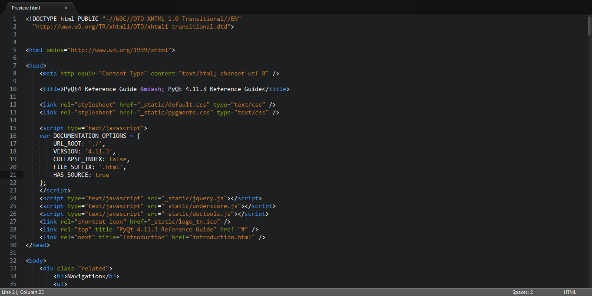

#Brackets Dark

A Sublime Text theme based on Brackets

##Design

## Installation
### Using Git

Locate your Sublime Text 2 `Packages` directory by using the menu item `Preferences -> Browse Packages...`.

While inside the `Packages` directory, clone the theme repository using the command below:

    git clone https://github.com/Drewmangd/Brackets-Dark.git

### Download Manually

* Download the files using the GitHub .zip download option
* Unzip the files
* Copy the folder to your Sublime Text 2 `Packages` directory

## Activating the theme

`Preferences -> Color Scheme -> Brackets Dark`.
